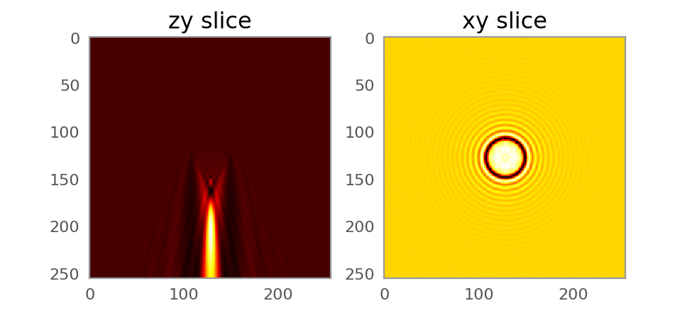

Examples
========

Focus field calculations 
------------------------

.. code:: python

   #The following snippet calculates the 3d focus field (PSF) of a simple beam with NA = 0.8 (both scalar and vectorial):

   from biobeam import focus_field_beam
   N = 256
   dx = 0.02
   
   # return the intensity
   u = focus_field_beam(shape = (N,)*3,
		  units = (dx,)*3,
		  NA = 0.8, n0 = 1.33)

   # return all the complex vector components
   u2, ex,ey,ez = focus_field_beam(shape = (N,)*3,
		  units = (dx,)*3,
          NA = 0.8,
		  n0 = 1.33,
		  return_all_fields = True)

   # vizualize
   import matplotlib.pyplot as plt
   plt.subplot(1,2,1)
   plt.imshow(u[...,N//2].T, cmap = "hot")
   plt.title("yz slice")
   plt.subplot(1,2,2)
   plt.imshow(u[N//2,...], cmap = "hot")
   plt.title("xy slice")

.. figure:: _static/example_psf.png
   :width: 500px
   :align: center

   
Plane wave scattered by sphere
------------------------------

.. code:: python

    from biobeam import Bpm3d
    # create the refractive index difference
    N = 512
    dx = 0.1
    r = 4
    x = dx*(np.arange(N)-N//2)	
    Z, Y, X = np.meshgrid(x,x,x,indexing = "ij")
    R = np.sqrt(X**2+Y**2+Z**2)
    dn = 0.05*(R<2.)

    # create the computational geometry
    m = Bpm3d(dn = dn, units = (dx,)*3, lam = 0.5)

    # propagate a plane wave and return the intensity
    u = m._propagate(return_comp = "intens")

    # vizualize
    import matplotlib.pyplot as plt
    plt.subplot(1,2,1)
    plt.imshow(u[...,N//2], cmap = "hot")
    plt.title("yz slice")
    plt.subplot(1,2,2)
    plt.imshow(u[N//2,...], cmap = "hot")
    plt.title("xy slice")

		   

Cylindrical light sheet through sphere
--------------------------------------

.. code:: python

    from biobeam import Bpm3d
    # create the refractive index difference
    N = 512
    dx = 0.1
    r = 4
    x = dx*(np.arange(N)-N//2)
    Z, Y, X = np.meshgrid(x,x,x,indexing = "ij")
    R = np.sqrt(X**2+(Y-.9*r)**2+Z**2)
    dn = 0.05*(R<r)

    # create the computational geometry
    m = Bpm3d(dn = dn, units = (dx,)*3, lam = 0.5)

    # propagate a plane wave and return the intensity
    u = m._propagate(u0 = m.u0_cylindrical(NA = .2), return_comp = "intens")

    # vizualize
    import matplotlib.pyplot as plt
    plt.subplot(1,2,1)
    plt.imshow(u[...,N//2].T,cmap = "hot")
    plt.title("yz slice")
    plt.subplot(1,2,2)
    plt.imshow(u[N//2,...], cmap = "hot")
    plt.title("xy slice")

.. figure:: _static/example_lightsheet.png
   :width: 500px
   :align: center

Single Bessel beam through sphere
---------------------------------

.. code:: python

    from biobeam import Bpm3d
    # create the refractive index difference
    N = 512
    dx = 0.1
    r = 4
    x = dx*(np.arange(N)-N//2)
    Z, Y, X = np.meshgrid(x,x,x,indexing = "ij")
    R = np.sqrt(X**2+(Y-.9*r)**2+Z**2)
    dn = 0.05*(R<r)

    # create the computational geometry
    m = Bpm3d(dn = dn, units = (dx,)*3, lam = 0.5)

    # propagate a plane wave and return the intensity
    u = m._propagate(u0 = m.u0_beam(NA = (0.5,0.52)), return_comp = "intens")

    # vizualize
    import matplotlib.pyplot as plt
    plt.subplot(1,2,1)
    plt.imshow(u[...,N//2].T,cmap = "hot")
    plt.title("yz slice")
    plt.subplot(1,2,2)
    plt.imshow(u[N//2,...], cmap = "hot")
    plt.title("xy slice")

.. figure:: _static/example_bessel.png
   :width: 500px
   :align: center

..

	  Computing the psf inside a cell phantom
	  ---------------------------------------

	  Aberration from sphere
	  ----------------------

