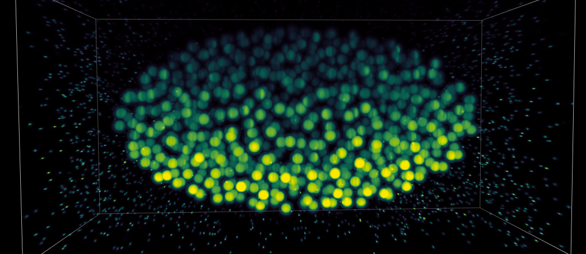

.. biobeam documentation master file, created by
   sphinx-quickstart on Wed Jun 29 19:00:27 2016.
   You can adapt this file completely to your liking, but it should at least
   contain the root `toctree` directive.

..
   biobeam- GPU accelerated simulation of light interacting with tissue
biobeam - a wave optical renderer to mimick image-formation in tissue microscopy
======================================================================================================

			  
.. toctree::
   :hidden:
   :numbered:
   :maxdepth: 2

   intro
   installing
   basic
   beams
   focus_field
   forward_model
   aberrations
   examples
			  
   	 
